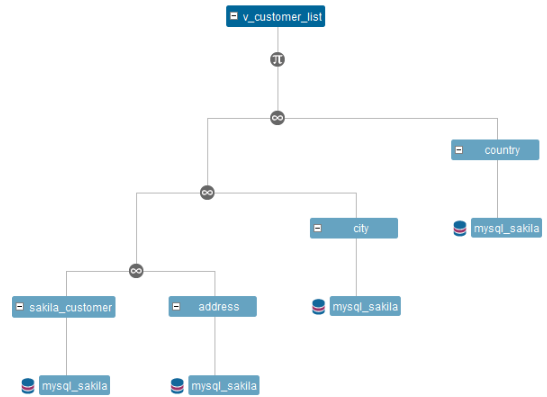

# DENODO VDP custom scanner for Enterprise Data Catalog

## Denodo Custom Scanner for EDC - Capabilities

* uses denodo jdbc driver to scan denodo virtual tables/views, including lineage inside and outside of denodo
* can scan multiple denodo databases (these are actually more like schemas for other databsae types)
* will extract lineage between views within denodo, at both the view & column level
* expression fields are processed - lineage should be created to all referenced source fields
    * the expression logic is stored in the "View Statement" system attribute `com.infa.ldm.relational.ViewStatement`
* for relational sources, and local delimited files, custom lineage is generated to link source tables/views to the actual dbms tables/views via connection assignment
* works with Denodo 7 or 8 - to ensure that it works for your version, replace `lib/denodo-vdp-jdbcdriver.jar` provided with the scanner, with your denodo jdbc driver jar file  (note:  you cannot use a denodo 7 jdbc driver with v8, or a v8 driver with v7).  v7 is packaged with the scanner


This document describes how to setup/use the Denodo Virtual Data Port Scanner.

The scanner is based on the standard relational database model `com.infa.ldm.relational`

Denodo is a data virtualization product and can be accessed via a JDBC Driver.  Since denodo acts a little differently to standard relational databases, we cannot use the generic JDBC scanner for Denodo.

In Denodo, there is no concept of a schema - only Databases, Tables and Columns.  To represent these properly in the catalog, *AND* provide the right structure for linking, we need to store both database and schema objects.


Since Denodo is a virtual layer - we also need to generate the lineage links back to the orignial data sources.


## Download the Scanner - from Github

you can download from this link https://github.com/Informatica-EIC/Custom-Scanners/blob/master/Denodo_Scanner/packaged/DenodoScanner.zip?raw=true

or use
```
wget -O DenodoScanner.zip https://github.com/Informatica-EIC/Custom-Scanners/blob/master/Denodo_Scanner/packaged/DenodoScanner.zip?raw=true
```

unzip the DenodoScanner.zip file & follow the steps below


## Configuring the Denodo Scanner

1 - (one time) create a resource-type for Denodo
  * from ldmadmin ui - select Manage | Custom Resource Types
  * click + to create a new Custom Resource type (if not already created)
  * Name=DenodoScanner  (changing the name is ok - this name)
  * Model=com.infa.ldm.relational  (browse to select only this model)
  * Connection Types=Database (for linking, no need to select schema)

2 - optional - setup an encryped password
    start the scanner passing only "password" as the first parameter
    e.g.
    .\denodoScanner.cmd password
    ./denodoScanner.sh password
    the encrypted password will be written to the console

    ```
    .\scanDenodo.cmd password
    Denodo Custom scanner: password currentTimeMillis=1619095359330
    Enter string to encrypt:
    length of value entered=9
    encryted text=xtlqK2V6ez+1rHptlqgwIFu9tNSo3MEY
    'Finished'
    ```
    if you use an encryped password - the value of the pwd setting is not used

3 - edit (or copy/clone) denodo.properties - used to control the scanner process

	```properties
	driverClass=com.denodo.vdp.jdbc.Driver
	URL=jdbc:vdb://[denodo host]:[denodo vdp port]/[denodo database]
	user=<user id>
	pwd=<password>
    encryptedPwd=<encrypted password>
	catalog=<list of databases to extract - comma seperated>

	# environment settings
	# customMetadta.folder  - location/folder where custom scanner output (&.zip) file(s) are created
	customMetadata.folder=denodo_custom_metadata_out

	# denodo specific settings - name of the database object to create
	denodo.databaseName=denodo_vdp

    # for 10.2.2hf1+ will create a relationships.csv for linking outside of the denodo environment
    # only use if you know this version is installed & you choose "ETL Resource" = Yes
    include.custlineage=true

    # debug=true - will create denodoScanner_debug.txt for troubleshooting
    debug=false

	```

4 - run the scanner

  * `scanDenodo.sh <propertyFile> [agreeToDisclaimer]`
  * output will be written to the folder referenced in denodo.properties (setting: `customMetadata.folder`) and will be named `denodoScanner.zip`
  * if the folder does not exist, it will be created (assuming the user has permissions to do so)
  * for older EDC versions (before v10.2.2hf1) custom lineage can be exported to folder referenced in denodo.properties (setting: `<customMetadata.folder>_lineage/denodo_lineage.csv`), using setting `include.custlineage=false`


5 - create a denodo resource
  * create a Denodo resource, using the resource type from Step 1
  * select the denodoScanner.zip file created by the denodo scanner (step 3 above - or configure to run the scanner as a pre-script, no file upload necessary)
  * set "ETL Resource" to Yes  (so the external lineage will be processed)
  * set "Auto Assign Connections" to Yes (connection assignment works like other scanners)
  * optionally - set "Run Pre-Script" to yes - to have EDC start the scan process - where you specify the folder that the scanner is installed & the script properties to run it & the output file (see screenprint below)
  * save and run

  


## Start the Scanner using SSL

both scanDenodo.sh and scanDenodo.cmd have variable placeholders to set the truststore file and truststore password

set values for
  - SCANNER_TRUSTSTORE=<truststore_file.jks>
  - SCANNER_TRUSTSTORE_PWD=<password for truststore>

### Running the Denodo Scanner

For Linux/macOS

`scanDenodo.sh <propertyFile> [agreeToDisclaimer]`

For Windows

`scanDenodo.cmd <propertyFile> [agreeToDisclaimer]`


scanner log/output is written to stdout (no specific file logging currently) - to pipe results to file

`scanDenodo.sh <propertyFile> > denodo_scan.log`

Note:  when starting the scanner - the following disclaimer will be displayed:

```
************************************ Disclaimer *************************************
By using the Denodo scanner, you are agreeing to the following:-
- this custom scanner is not officially supported by Informatica
  it is a work in progress based on use-cases/examples we have seen so far
- there are some limitations for external linking/lineage for non-relational data sources.
  external references (Custom Lineage) is only generated for JDBC,ODBC and LOCAL DF sources in the current version
- Issues can be created on githib:-
  https://github.com/Informatica-EIC/Custom-Scanners/issues
*************************************************************************************
```

the user will be prompted to agree to this disclaimer each time the scanner is run, or by passing "agreeToDisclaimer" as the 2nd command-line parameter.  (not case sensitive)


## Design Notes


* extends the Generic JDBC Custom scanner for denodo specific functions
   * reads denodo.databaseName setting from the .properties file - default value if not provided is "denodo_vdp"
   * initFiles() - creates a custom lineage file in `<customMetadata.folder>_lineage`
   * getCatalogs() - uses `denodo.databaseName` as the Database object in the catalog (shifts the actual catalog name as the Schema name)
   * getSchemas() - calls `dbMetaData.getCatalogs()` as Denodo has no concept of schema - but the catalog requires it
   * getTables() - for each table, also generates custom lineage (extracts the connection name from the table 'wrapper')
   * getViews() - calls the `GET_VIEWS()` procedure (does not use standard jdbc get tables)
   * other calls made
      * for each source table (to get the source connection name for lineage)  `DESC VQL WRAPPER JDBC <database>.<table>`
      * extracts column dependencies for views using the procedure - `COLUMN_DEPENDENCIES()`


# Disclaimer/Limitations

* profiling will not be possible (yet, until it is supported with custom scans)
* custom lineage for tables is only possible for JDBC,ODBC and LOCAL DF connections (need test cases for other types)
* this is not an official informatica supported product - but any issues can be logged on github https://github.com/Informatica-EIC/Custom-Scanners/issues
* custom lineage to non-relational resources has not been attempted


# Example

The following example shows how objects stored in Denodo is represented after scanning into the catalog.

this example reads data from mySQL, joins several tables and calculates a single value (concatenating to fields), using a denodo database named "sakila_vdb" - this is imported into the catalog as a schema with the same name.


The view `v_customer_list` is represented in denodo like this (either lineage or tree view)



and after scanning into the catalog - the lineage looks like this (internal to denodo only, without scanning the mysql database)

Note:  the schema name is not included in these lineage diagrams


the System Attribute:  Location `com.infa.ldm.relational.Location` is used to store the folder location for the object in denodo.  in this example the folder `/3 app views` is used as the location for `v_customer_list`

the `full_name` field for the `v_customer_list` view is calculated using the following expression:-


after scanning into EDC - lineage for full_name shows the 2 fields that are used for the expression/calculation.


and - the expression used is stored in the View Statement attribute `com.infa.ldm.relational.ViewStatement`


an extract of the custom lineage file generated by the scanner - shows that connection assignments are used - reflecting the denoeo environment & objects referenced


after importing (either using automatic or manual connection assignment - and ensuring the connections point to the right place) the lineage should be complete.


and the lineage now shows a connection back to the mysql database structures - note the customer table in mysql was re-labeled to sakila_customer.


Example 2:  multiple steps in Denodo


and after importing into EDC - also showing that `amount_due_by_client` is also connected downstream


