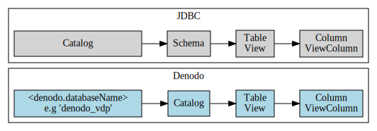
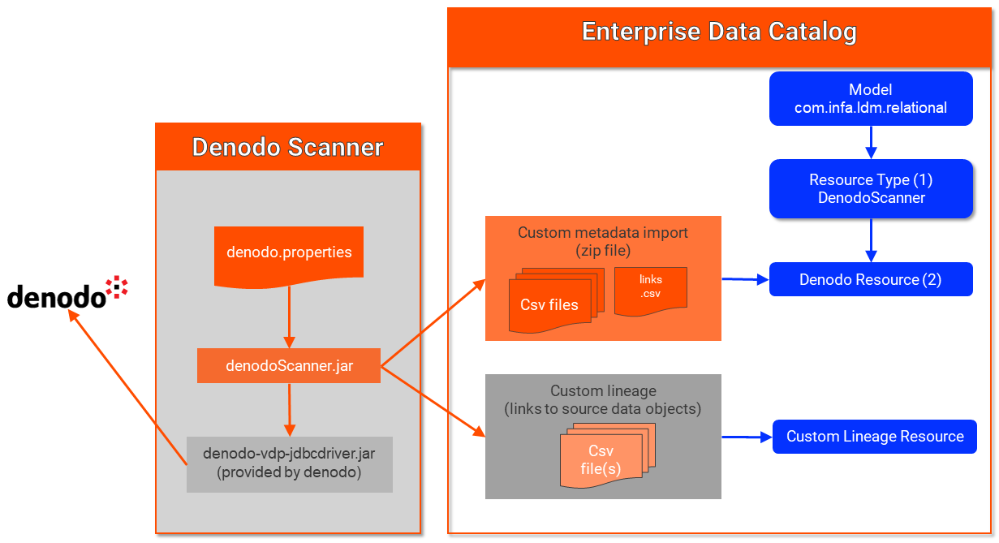

# DENODO VDP custom scanner for Enterprise Data Catalog

This document describes how to setup/use the Denodo Virtual Data Port Scanner.

The scanner is based on the standard relational database model `com.infa.ldm.relational`

Denodo is a data virtualization product and can be accessed via a JDBC Driver.  Since denodo acts a little differently to standard relational databases, we cannot use the generic JDBC scanner for Denodo.

In Denodo, there is no concept of a schema - only Databases, Tables and Columns.  To represent these properly in the catalog, *AND* provide the right structure for linking, we need to store both database and schema objects.
 



Since Denodo is a virtual layer - we also need to generate the lineage links back to the orignial data sources.




### Configuring the Denodo Scanner

1 - (one time) create a resource-type for Denodo
  * from ldmadmin ui - select Manage | Custom Resource Types
  * click + to create a new Custom Resource type (if not already created)
  * Name=DenodoScanner  (changing the name is ok - this name)
  * Model=com.infa.ldm.relational  (browse to select only this model)
  * Connection Types=Database (for linking, no need to select schema)

2 - edit (or copy/clone) denodo.properties - used to control the scanner process

	```properties
	driverClass=com.denodo.vdp.jdbc.Driver
	URL=jdbc:vdb://[denodo host]:[denodo vdp port]/[denodo database]
	user=<user id>
	pwd=<password>
	catalog=<list of databases to extract - comma seperated>
	
	# environment settings
	# customMetadta.folder  - location/folder where custom scanner output (&.zip) file(s) are created
	customMetadata.folder=denodo_custom_metadata_out
	
	# denodo specific settings - name of the database object to create
	denodo.databaseName=denodo_vdp
	```   

3 - run the scanner 

  * `scanDenodo.sh <propertyFile>`
  * output will be written to the folder referenced in denodo.properties (setting: `customMetadata.folder`)
  
 
4 - create a denodo resource
  * create a Denodo resource, using the resource type from Step 1
  * select the .zip file created by the denodo scanner (step 3 above)
  * save and run


### Running the Denodo Scanner

`scanDenodo.sh <propertyFile>`

scanner log/output is written to stdout (no specific file logging currently) - to pipe results to file

`scanDenodo.sh <propertyFile> > denodo_scan.log`


## Design Notes


* extends the Generic JDBC Custom scanner for denodo specific functions
   * reads denodo.databaseName setting from the .properties file - default value if not provided is "denodo_vdp"
   * initFiles() - creates a custom lineage file in `<customMetadata.folder>_lineage` 
   * getCatalogs() - uses `denodo.databaseName` as the Database object in the catalog (shifts the actual catalog name as the Schema name)
   * getSchemas() - calls `dbMetaData.getCatalogs()` as Denodo has no concept of schema - but the catalog requires it
   * getTables() - for each table, also generates custom lineage (extracts the connection name from the table 'wrapper')
   * getViews() - calls the `GET_VIEWS()` procedure (does not use standard jdbc get tables)


# Disclaimer/Limitations

* profiling will not be possible (yet, until it is supported with custom scans)
* custom lineage for tables is only possible for JDBC connections (need test cases for other types)
